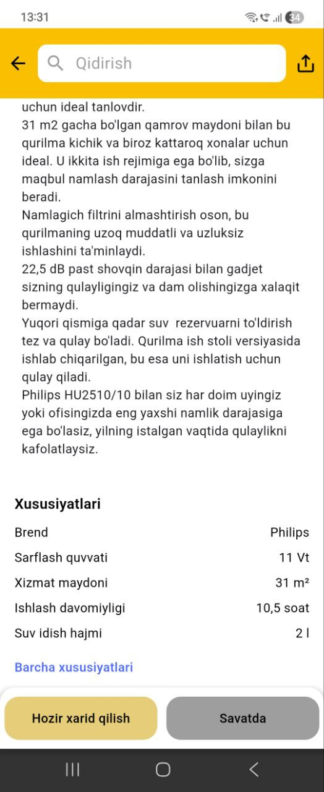

# Texnomart
This project is an educational clone inspired by Texnomart.  It is not affiliated with, endorsed by, or connected to the original brand.

# 🛒 Texnomart Clone App (Flutter)

This project is a **Flutter-based e-commerce application** inspired by **Texnomart**.
The app is built as an **educational and portfolio project**, demonstrating modern Flutter development practices, clean architecture, and scalable state management.

---

## ⚠️ Disclaimer

> This project is an educational clone inspired by Texnomart.
> It is **not affiliated with, endorsed by, or connected to** the original Texnomart brand.

---

## 📱 App Overview

The **Texnomart Clone App** replicates the core functionality of a modern e-commerce platform for electronics and home appliances.

Users can:

* Browse products by categories
* View banners and promotions
* Explore detailed product pages
* Read rich HTML descriptions
* Add products to favorites
* Cache and store data locally for better performance

The app focuses on **performance**, **clean UI**, and **real-world architecture**.

---

## 🧭 App Screens 

### 🔹 Home Screen

The main landing screen of the app.

**Includes:**

* 🔄 **Carousel Slider**

    * Promotional banners
    * Auto-sliding 
* 📂 **Category Section**

    * Electronics
    * Home appliances
    * Smartphones
    * TVs and accessories
* 📦 **Popular / Recommended Products**

    * Horizontally scrollable lists

**Technologies used:**

* `carousel_slider`

---

### 🔹 Category Screen

* Displays products filtered by selected category
* Smooth scrolling experience

---

### 🔹 Product Detail Screen

Opened when a user taps on a product.

**Displays:**

* 🖼 Product image gallery (slider)
* 📝 Product name
* 💰 Price (formatted with `intl`)
* ⭐ Product attributes
* 📄 Rich description rendered via HTML

**Features:**

* HTML product descriptions using `flutter_html`
* Image caching for performance
* Clean and responsive layout

---

### 🔹 Favorites Screen

* Displays user’s favorite products

**Local storage:**

* `Hive`
* `Sqflite`

---

## 🔄 State Management & Architecture

### 🧠 BLoC Architecture

* `flutter_bloc` & `bloc`
* Clear separation of:

    * UI
    * Business logic
    * Data layer

### 🧩 Dependency Injection

* `get_it` used for service locator
* Easy testing and scalability

### ❄️ Immutable Models

* `freezed`
* `json_serializable`
* Type-safe API models

---

## 🌐 Networking

* **Dio**

    * Powerful HTTP client
* **Retrofit**

    * Clean API abstraction
* **Talker Dio Logger**

    * Network request logging
    * Debug-friendly output

---

## ⚙️ Technologies Used

### 🔹 Core

* **flutter_bloc (^9.1.1)**
* **bloc (^9.1.0)**
* **dio (^5.9.0)**
* **retrofit (^4.9.1)**

### 🔹 UI & UX

* **carousel_slider (^5.1.1)**
* **cached_network_image (^3.4.1)**
* **flutter_svg (^2.2.3)**
* **flutter_html (^3.0.0)**
* **dots_indicator (^4.0.1)**

### 🔹 Data & Storage

* **hive (^2.2.3)**
* **hive_flutter (^1.1.0)**
* **path_provider (^2.1.5)**

### 🔹 Utilities

* **intl (^0.20.2)**
* **equatable (^2.0.8)**
* **meta (^1.17.0)**

### 🔹 Code Generation

* **freezed (^3.2.3)**
* **freezed_annotation (^3.1.0)**
* **json_serializable (^6.10.0)**
* **build_runner (^2.10.4)**
* **retrofit_generator (^10.0.1)**

---

## 🏗 Project Architecture

* Clean Architecture principles
* Scalable and maintainable codebase
* Ready for production-level expansion

---

## 🎯 Purpose of the Project

* Improve Flutter architectural skills
* Practice real-world e-commerce flows
* Demonstrate advanced Flutter packages
* Portfolio-ready showcase project

---

## 📌 Conclusion

The **Texnomart Clone App** is a feature-rich Flutter project that demonstrates:

* Advanced state management
* Clean networking layer
* Efficient local storage
* Modern UI components

This project is ideal for **learning**, **portfolio presentation**, and **technical interviews**.

